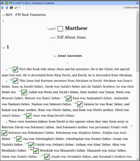

---
title: What is it and What Makes a Good One? (3.2a)
---
### What is a back translation?

A back translation is a way to check a translation. In Bible translation, the vernacular text is translated into a major language so that a translation consultant who is not fluent in the vernacular can examine the translation and help the team improve it. In Paratext, a back translation is done in a separate but linked project.

### What are the qualities of a good back translation?

-   Done by someone not involved in drafting the vernacular translation.
-   Natural, and reflect how the back translator understands the sense of the vernacular text.
-   Without using any helps or other Bibles.
-   Reflect what the vernacular text says and not what it should say.
