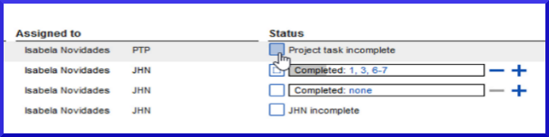
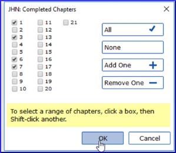

[Watch video](https://vimeo.com/461793250)

As you work on the tasks assigned to you in Paratext, you need to record what you have finished.This allows the team to see your progress, and **most importantly** allows other team members, who are waiting for your task to be finished, to get started on their tasks.

**Open Assignments and progress**

-   Click on the blue button .

**Mark tasks as complete**

-   Mark **project task** or **book task** as complete: click the check box

    

-   Mark **chapter task** as complete: click blue **+**, or unmark click blue **-**
  
-   For more control click none (or chapter numbers), click the chapter numbers

    

-   Click **OK**

**Useful links:**

Prev (Book or Priority), Next (Book or Priority), All tasks

**Send/Receive**

Remember to Send/Receive so that other team members receive the progress status information.

