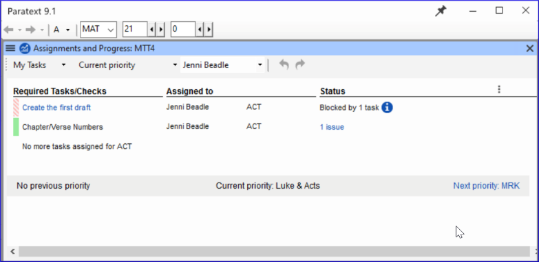

## 1.1 My Tasks  (Project Plan and Progress)

The administrator of your project can assign tasks to you in Paratext. The task assignments control what you can edit.

## View tasks assigned to you

-   Click on the blue button to open Assignments and progress.  
    *The Assignments and Progress window opens, showing **My Tasks** in the **Current Priority** or the last view*.

    

## Next/Previous Links

-   **Prev priority** – previous book with tasks
-   **Next priority**- next book with tasks
-   Change to **All Tasks** – to see tasks waiting

## View tasks by book

-   Where it says **Current Priority**, click to view the menu.
-   Click **Current Book**.  
    *This is the default filter if your administrator has not set up Priorities*.
-   View tasks in another book by clicking **Next book** or **Previous book**.

## State of tasks

- **Green**: Tasks that can be started right away are marked with **green**.
- **Striped green**: Waiting on you to finish another task.
- **Red:** Tasks are dependent on earlier tasks being finished by others.
- **Grey**: Task is complete

Hover the mouse over the **information icon** to find out what is blocking it.

Click **Show more tasks** to see hidden tasks.

