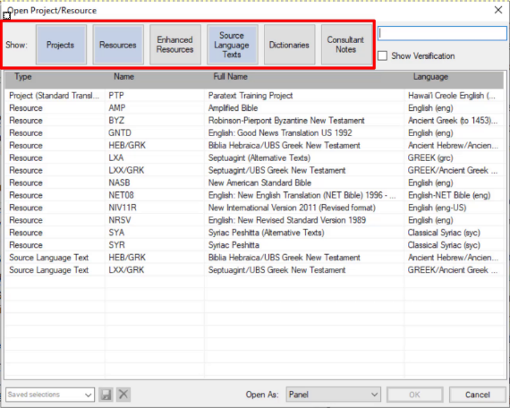

---
title: Basics of project/resource  (0.2.1b)
---

Paratext allows you to view several projects or resources at the same time.

Each project or resource is shown in a window, with its own title bar and menu. Projects can be editable but resources are never editable.

### To open a project or resource

-   Click the **main Paratext menu ≡**, and then click **Open**.  
  *The Open Project/Resource dialog box appears*.

    

-   Filter or search for the files you want
-   The row of buttons along the top allows you to **filter** which types of files you see displayed in the list below.
-   Alternatively, you can use the **search box** to find the file you need to open.
-   To open a file,
-   Click the filename in the list
-   Choose the type of window (panel, tab, floating window, etc)
-   Click **OK**.  
    *A new window opens*.

:::tip
When you start Paratext it will re-open the projects and resources you had open when you last closed Paratext. It also places your cursor in the verse where you last had your cursor.
:::
