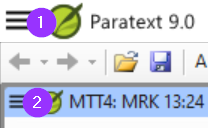

Remember there are two menus – one for all of Paratext and the second for any project window or pane.

There are three other things to know about the menus:

1.  Not just projects and resources, but other windows have their own menus
    1.  There are two sets of menus – standard and full.
-   A standard menu can be expanded by clicking on wedge at the bottom.
    1.  You can search for menu commands
-   Click on search box, type command

    

-   Click on the desired command in results list

    

The menu search works even if you are in standard menus and the command you are searching is normally hidden.

The same search also shows help topics.

