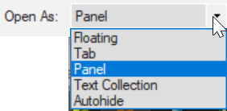

---
title: Text collection (0.2.2a)
---
:::caution Upgrade
In Paratext 9.3 there are two ways to open a text collection.
:::
A Text Collection allows us to display several resources in one window. Unlike a tabbed window, a text collection shows us one verse at a time from each resource.

### Create a text collection

~~-   Close any resources that are already open~~
-   Click the **Open** button on the toolbar.
-   Hold the CTRL key down while clicking to select several files.
-   In the **Open As** dropdown, select **Text Collection panel**.

    

-   Click **OK**.  
    *Paratext opens the selected resources in a new window, and displays the current verse*.

### Text collection – see more context

-   Click blue hyperlink of a resource name OR
-   Click Tab menu, under **View** \> **Two panes**

### Text collection – close right hand pane

-   Click the little **X** within the right hand pane.
-   OR Click the menu button on the title bar, under View, click Two Panes

### Modify text collection

You can modify the text collection by change the order of resources, removing a resource or adding a resource.

#### Change order of resources

-   Right click on one and select Move up or Move down.

#### Remove a resource from the text collection.

-   If we want to remove this resource, right click and select **Close**.

#### Add resources

-   Open the menu for this window panel.
-   Click “**Modify Text collection**”.  
    *The “Select Texts” dialog box opens*.

>    List of the left is all available projects and resources.  
>    List on the right is what is currently shown in the text collection window.

-   Click **left** or **right** arrows to add or remove resources
-   Click **up** or **down** arrow to reorder resources
-   Click **OK** to make changes occur in the text collection window.

