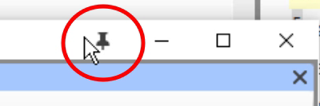

### Tip1: How to swap windows

Swapping two windows may involve two or more steps. [For example, drag one to the left edge and end up with an extra column, then drag the other to the lower right corner (back to original number of columns).]

An alternative way to swap these two texts is by using the project list.

### Tip 2: How to undo moving a window

If you make a mistake with a drag,

-   Click on the main Paratext menu.
-   Click Undo Tab move.

### Tip 3: How to unpin floating windows

When the thumbtack is slanted, this window no longer stays on top all the time.

If you want it to always stay on top again, click the thumbtack icon to pin it.

### Tip 4: How to widen the autohide column

The autohide column can be made a little wider if desired.

-   Click the arrow at the top of the column.

    

### Tip 5: How to undo closing a window

-   Click the main Paratext menu
-   Choose Undo Tab Close

## 0.2.3e Going to non-Biblical books

There are many non-biblical books listed after REV (also Deuterocanonical books)

e.g. GLO, XXA … XXG

