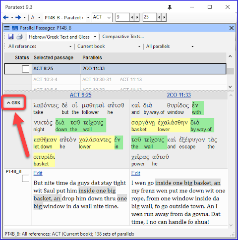

Parallel passages are similar, but very rarely identical, passages in different books of the Bible.

Paratext provides the Parallel passages tool to allow you to review your translations of these similar passages.

### Open the Parallel passages tool

-   Open the **menu** for the project.
-   **Expand** the menu.
-   Under **Tools**, click **Parallel Passages**.

    The Parallel Passages Tool opens in a floating window.

### To display a resource or project

-   Click “**Comparative Texts**”.
-   Select and add the resources or projects you want to view.
-   Click **OK**.

    The resources are now displayed below.

### Display the original language versions

-   Click the “Hide/Show Hebrew/Greek Source Text” chooser on the toolbar.
-   Select one of the “Hebrew/Greek Text” options.

    The original language version of the passages is displayed below.

    **Identical words are highlighted in green and similar words are highlighted in yellow.**
    
:::caution 9.3 upgrade
###    You can collapse the Hebrew/Greek source text
**Collapse**: To the left of the text, click the **^** beside the project name  
*The row is reduced with the name of the text and an expand icon*
  
**Expand**: To expand it again, click the **v**  
*The text is visible again.*  
:::

### To edit one of the passages

-   Click the Edit command displayed above the passage.

    The passage opens in a small window which uses unformatted view.

Take care not to accidentally edit one of the USFM markers.

The Edit command will not be displayed if you do not have editing permission for that passage.

### To view a passage in context

-   Click the Passage reference immediately above it.

    The project window scrolls to display the relevant passage.

-   You can edit there instead, assuming you have editing permission.

### To return to previous book

If Paratext has scrolled to a different book

-   Click the ←back button

    The book you were looking at before is displayed.

### Approve passages

When the parallel passages have been compared and you are satisfied that they have been translated appropriately,

-   Click the checkbox next to the project text (or in the status column).

    This checkmark means the **entire set** of parallel passages has been approved.

### Three modes for approving

-   Open the **menu** for the window.
-   Under **View** you can choose between
-   **Approve Sets of Parallels** - which is the default -
-   **Approve Passages individually** individual check boxes
-   **Approve by Set or Individually**, which allows you to switch back and forth between modes.

### To change from set to individually

-   Open the menu for the window.
-   Under View, choose Approve by Set or Individually.

    Initially, a checkbox for the entire set is shown in the Status column.

-   Hover the mouse over the lower checkbox for the set

    A pencil icon is shown.

-   Click the **pencil**

    The checkboxes move to the other mode but only for this set of passages.
