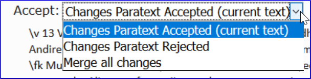

## What they look like and how to deal with them
[Watch video](https://vimeo.com/438192934)

In this video we will see what conflict notes look like and how to deal with them. This is the same in Paratext 8 and 9.

-   Do a Send/Receive
-   Click link Open unresolved conflict notes list window.

**Open note and resolve conflict**

-   **Open** note
-   If the note is assigned to you, or you are an administrator, there will be a dropdown list
-   Click the Dropdown the list at the top

    

-   Choose an option as appropriate
-   **Accept** the changes Paratext **accepted** (leave it as is)
-   **Accept** the changes Paratext **rejected** (and reject the other change)
-   **Merge** all changes (accept both changes)
-   Click **OK**

Special warning flag for conflict notes are either at the very beginning of the book or at the verse number.

-   **Resolve** the note to make the flag go away.

**Send/Receive**

-   Do a Send/Receive

**Complex conflicts**

If there are many conflicts, your administrator may need to *revert* the book(s).
