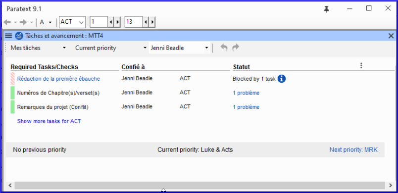

L’administrateur de votre projet peut vous confie des tâches dans Paratext. Les attributions de tâches contrôlent ce que vous pouvez éditer.

#### Afficher les tâches qui vous sont assignées

-   Ouvrez les Tâches et affectations en cliquant sur le bouton bleu 

    La fenêtre **Tâches et avancement** s'ouvre, affichant Mes tâches dans la priorité actuelle ou dans la dernière vue.

    

#### Liens suivants/précédents

-   **Priorité précédente** - livre précédent avec tâches
-   **Priorité suivante** - suivant livre avec tâches
-   Changer à **Toutes les tâches** - pour voir les tâches en attente.

#### Afficher les tâches par livre

-   Là où il est dit **Priorité actuelle**, cliquez pour afficher le menu.
-   Cliquez **Livre actuel**.

    Il s’agit du filtre par défaut si votre administrateur n’a pas configuré Les priorités.

-   Voir les tâches dans un autre livre en cliquant sur **Livre suivant** ou **Livre précédent**.

#### État des tâches

**Vert :** Les tâches qui peuvent être lancées immédiatement sont marquées en vert.

**Vert rayé :** En attendant que vous finissiez une autre tâche.

**Rouge :** Les tâches dépendent des tâches antérieures terminées par d’autres.

**Gris :** La tâche est achevée

-   Placez la souris au-dessus de l’icône d’information pour savoir ce qui la bloque.
-   Cliquez sur **Afficher les tâches bloquées** pour voir les tâches cachées.

