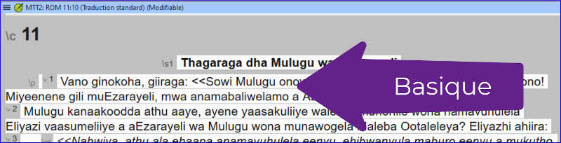

---
title: Comment utiliser l'affichage basique (1.2.2c)
---
[Regarder le vidéo](https://vimeo.com/446740535)

Dans cette vidéo, nous avons appris à travailler en affichage basique. L'affichage basique affiche les marqueurs USFM, mais vous ne pouvez pas les modifier ni en ajouter dans cet affichage. Vous pouvez seulement saisir et avoir le curseur dans les zones blanches. Pour utiliser cet affichage, quelqu’un doit avoir configuré tous les marqueurs nécessaires à votre traduction pour vous à l’avance.

#### Pour passer à l'affichage basique

-   Ouvrez le menu du projet **≡**.
-   Développez le menu si nécessaire.
-   Sous Affichage, cliquez sur **Basique**.

#### Pour passer à l’endroit suivant pour taper

-   Utilisez la touche fléchée pour passer à l’endroit suivant pour taper.
-   Ou cliquez sur la zone de texte pour y déplacer le curseur.

