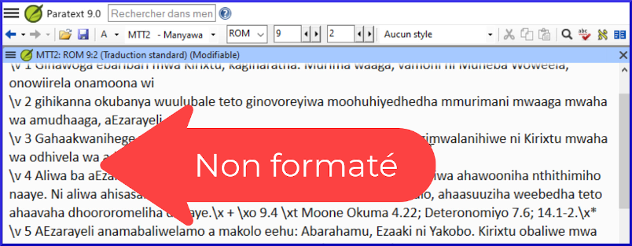

---
title: À quoi sert l'affichage non formaté ? (1.2.2d)
---
[Regarder le vidéo](https://vimeo.com/464585929)

Dans cette vidéo, nous regardons l'affichage non formaté.

#### Pour passer à l'affichage non formaté

-   Ouvrez le menu **≡** projet.
-   Développez le menu si nécessaire.
-   Sous Affichages, cliquez sur **Non formaté**.

    L'affichage Non formaté montre l'ensemble du document en texte clair.

Note :

-   Dans l'affichage Non formaté, les balises USFM et le texte de la Bible ne se distinguent visuellement par aucun type de mise en forme.
-   Il n'existe pas d'outils pour vous aider à appliquer ou à saisir les balises USFM, mais vous pouvez les modifier directement en les tapant simplement.
-   Cet affichage facilite l'édition manuelle des balises si nécessaire.
-   Ce point d'affichage n'est pas recommandé pour la rédaction de la traduction.

