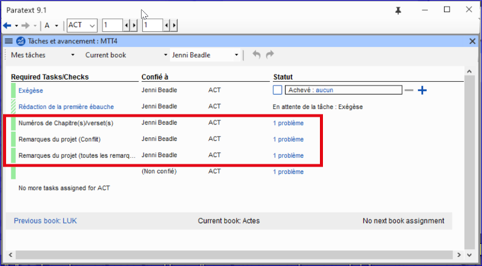
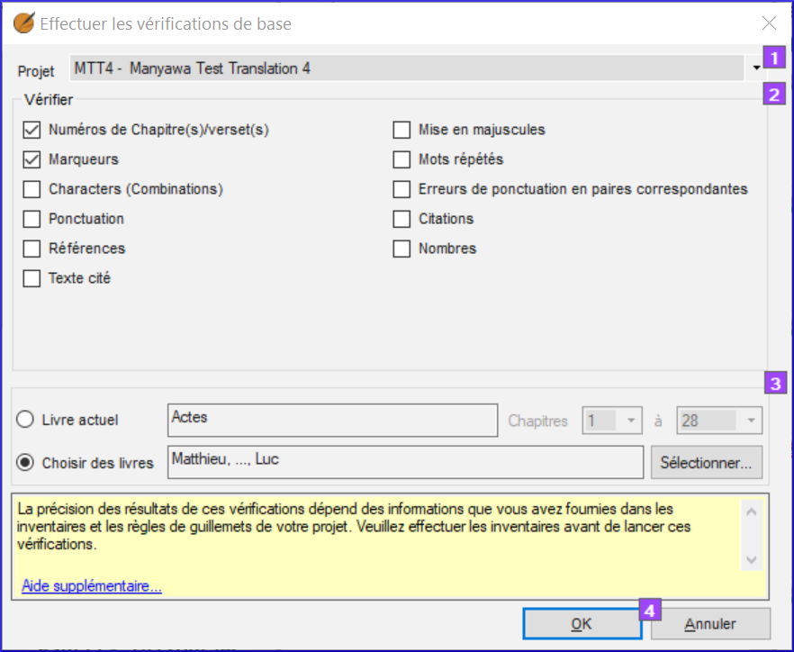

---
title: Vérifications de base - Chapitre/Verset (1.4.1)
---
[Regarder le vidéo](https://vimeo.com/486312960)

Paratext offre plusieurs outils permettant de vérifier la cohérence et l'exactitude d'une traduction. Ces outils sont appelés "Vérifications". Certaines vérifications nécessitent une configuration. Il est important de corriger tout problème avec les marqueurs de chapitre et de verset, car, en présence de ces erreurs, il peut être difficile pour Paratext de nous montrer exactement où se trouvent les choses (par exemple, la liste des mots). Nous vous recommandons de commencer à examiner ces problèmes dès le début, avant même de terminer un livre.

#### Utiliser le plan de projet

Si des vérifications vous ont été confiées, elles sont affichées dans la vue "Mes tâches" de la fenêtre " Tâches et avancement ".

Pour afficher les problèmes trouvés par une vérification,

-   Cliquez sur le nombre de problèmes.

    Paratext énumère les éléments dans un panneau de fenêtre.

    Il y aura un problème de versets manquants pour une partie du texte qui n'a pas encore été rédigé. Ce n'est pas grave. Concentrez-vous sur les problèmes qui se trouvent dans les chapitres que vous avez rédigés.

-   Corriger les erreurs dans la liste si nécessaire
-   Double-cliquez sur le problème

    Paratext déplace le projet vers cette référence.

-   **Versets manquants** - vérifier \\v et mettre un espace avant le numéro
-   **Verset dupliqué** - souvent des espaces entre les chiffres
-   **Marqueur inconnu** - vérifier le nom du marqueur ou un espace avant le numéro de verset
-   **Numéro de verset dans l'en-tête** - insérer un marqueur de paragraphe

#### Effectuer les vérifications manuellement

Vous pouvez également effectuer les vérifications manuellement

-   Cliquez sur le menu du projet **≡**, sous Outils, \> **Effectuer les Vérifications de base.**

    

-   Choisissez les vérifications souhaitées, par exemple **Numéros de chapitre(s)/verset(s)**, et **Marqueurs** et les marqueurs.
-   Cliquez sur **OK**
-   Corriger les erreurs dans la liste si nécessaire comme ci-dessus.
-   Relancer la vérification pour s’assurer que l’erreur est corrigée.

