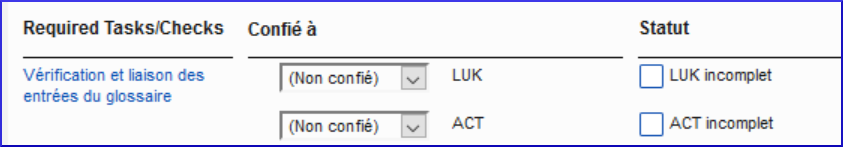
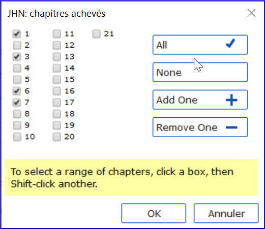

[Regarder le vidéo](https://vimeo.com/495519701
)

Lorsque vous travaillez sur les tâches qui vous sont confiées dans Paratext, vous devez enregistrer ce que vous avez terminé. Cela permet à l'équipe de voir votre avancement et, surtout, aux autres membres de l'équipe, qui attendent que votre tâche soit terminée, de commencer leur travail.

#### Ouvrir les Tâches et avancement

Cliquez sur le bouton bleu .

#### Marquer les tâches comme achevées

-   Marquez **la tâche du projet** ou **la tâche du livre** comme achevée : cliquez sur la case à cocher

    

-   Marquez **la tâche du chapitre** comme terminée : cliquez sur le **+** bleu, ou bien démarquez : cliquez sur le **-** bleu
-   Pour plus de contrôle, cliquez sur aucun (ou sur les numéros de chapitre), cliquez sur les numéros de chapitre

    

-   Cliquez sur **OK**

#### Liens utiles

Précédent (Livre ou Priorité), Suivant (Livre ou Priorité), Toutes les tâches

#### Envoyer/Recevoir

N'oubliez pas d'envoyer/recevoir afin que les autres membres de l'équipe reçoivent les informations sur l'état d'avancement.

