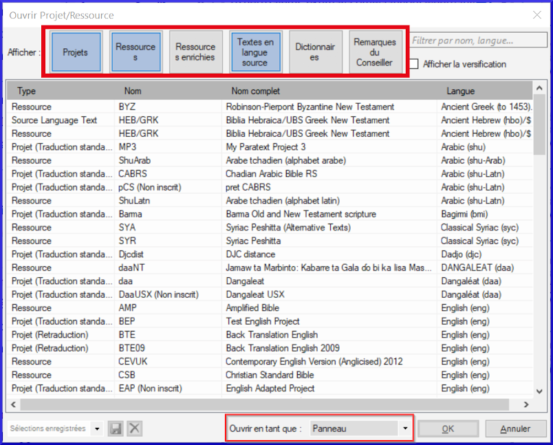

---
title: Les bases des projets et des ressources (0.2.1b)
---
[Regarder le vidéo](https://vimeopro.com/lingtransoft/paratext9fr/video/411837591)

Paratext vous permet d'afficher plusieurs projets ou ressources en même temps. Chaque projet ou ressource est affiché dans une fenêtre, avec sa propre barre de titre et son propre menu. Les projets peuvent être modifiables, mais les ressources ne le sont jamais.

## Pour ouvrir un projet ou une ressource

-   Cliquez sur le menu principal de Paratext **≡**, puis cliquez sur **Ouvrir**.

    La boîte de dialogue Ouvrir le projet/ressource s’affiche.

    

## Filtrer ou rechercher les fichiers souhaités

-   La rangée de boutons en haut de la boîte de dialogue vous permet de filtrer les types de fichiers que vous voyez affichés dans la liste ci-dessous.
-   Vous pouvez également afficher tous les types de fichiers et utiliser ensuite la boîte de recherche pour trouver le fichier que vous devez ouvrir.

## Pour ouvrir un fichier :

-   Cliquez sur le nom de fichier dans la liste
-   Choisissez le type de fenêtre (panneau, onglet, fenêtre flottante, etc.)
-   Cliquez sur **OK**.

    Une nouvelle fenêtre s'ouvre, qui affiche le fichier sélectionné.

Lorsque vous démarrez Paratext, il rechargera exactement les mêmes fenêtres qui étaient ouvertes la dernière fois. Il place également votre curseur dans le verset où le curseur était en dernier.
