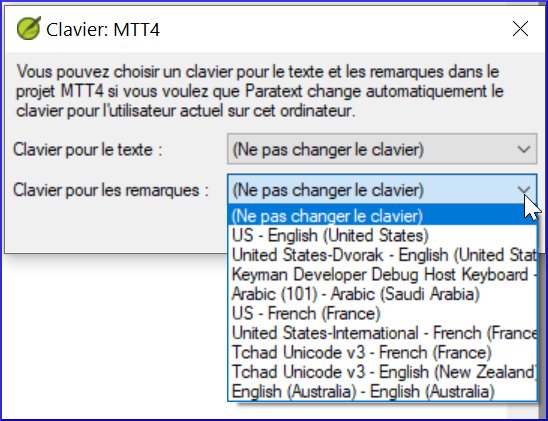

[Regarder le vidéo](https://vimeopro.com/lingtransoft/paratext9fr/video/425987455)

Paratext peut être configuré pour activer un clavier automatiquement lorsque le curseur est dans un projet qui en a besoin [à condition que Keyman et le clavier soient installés.]

-   Cliquez sur le menu Projet **≡**
-   Déplacez la souris sur paramètres du projet.
-   Dans le sous-menu, sélectionnez **Clavier**.

    La boîte de dialogue du clavier pour ce projet s'ouvre.

    

-   Choisissez le clavier Keyman pour saisir du texte.
-   Choisissez le clavier pour la saisie des notes.
-   Cliquez sur **OK**.
