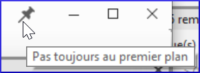
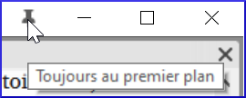
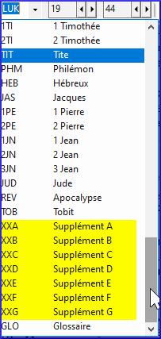

[Regarder le vidéo](https://vimeopro.com/lingtransoft/paratext9fr/video/419314037)

## Conseil 1 : Comment changer de fenêtre

-   L'échange de deux fenêtres peut impliquer deux ou plusieurs étapes. [Par exemple, faites glisser l'une d'entre elles vers le bord gauche et obtenez une colonne supplémentaire, puis faites glisser l'autre vers le coin inférieur droit (pour revenir au nombre initial de colonnes).
-   Une autre façon d'échanger ces deux textes est d'utiliser la liste des projets.

## Conseil 2 : Comment annuler le déplacement d’une fenêtre

Si vous faites une erreur avec un déplacement,

-   Cliquez sur le menu principal de **≡ Paratext**.
-   Cliquez sur Annuler le déplacement d’onglet.

## Conseil 3 : Comment désancrer les fenêtres flottantes

-   Lorsque la punaise est inclinée, cette fenêtre ne reste plus tout le temps au dessus.

    

-   Si vous voulez qu'il reste toujours au sommet, cliquez sur l'icône de la punaise pour l'épingler.
-   

## Conseil n°4 : Comment élargir la colonne Masquer automatiquement

La colonne Masquer automatiquement peut être rendue un peu plus large si vous le souhaitez.

-   Cliquez sur la flèche en haut de la colonne.

    

## Conseil 5 : Comment annuler la fermeture d’une fenêtre

-   Cliquez sur le menu principal de **≡ Paratext**
-   Choisir Annuler la fermeture de l’onglet

## 0.2.3e Comment consulter d'autres textes liés à la Bible dans Paratext

[Regarder le vidéo](https://vimeopro.com/lingtransoft/paratext9fr/video/443500451)

De nombreux livres non bibliques sont répertoriés après Apocalypse (REV) (également les livres deutérocanoniques)

S'ils ont été créés dans le projet, vous pouvez accéder à ces livres en cliquant sur "Sélectionner un livre" dans la barre d'outils.

-   par exemple GLO, XXA ... XXG

    

## 0.2.4 Navigeur rapide aux versets bibliques

[Regarder le vidéo](https://vimeopro.com/lingtransoft/paratext9fr/video/449749686)

## Aller à une référence biblique spécifique

-   **Ctrl+ B**
-   Tapez l’abréviation de 3 lettres du nom du livres :
-   Tapez **ÉSPACE**, puis tapez le numéro de chapitre
-   Appuyez sur **ÉSPACE** typez le numéro de verset, appuyez sur  **ENTRÉE**

## Aller au début d'un livre

-   **Ctrl+ B**, tapez l'abréviation de 3 lettres du nom du livre appuyez sur **ENTRÉE**

## Aller au début d'un chapitre

-   **Ctrl+ B,** tapez l'abréviation de 3 lettres du nom du livre
-   Tapez **ÉSPACE** tapez le numéro de chapitre appuyez sur **ENTRÉE**

## Aller à un livre par titre

-   **Ctrl+B**
-   Commencez à taper le titre du livre
-   Choisissez dans la liste.
-   Appuyez sur **ENTRÉE**
