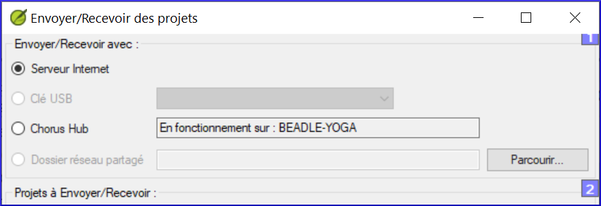

---
title: Comment recevoir un projet partagé pour la première fois (0.4b)
---
Lorsque l'administrateur vous a ajouté au projet, utilisez la

commande **Envoyer/Recevoir** pour obtenir une copie du projet sur votre ordinateur.

### Envoyer/recevoir par Internet

-   Ouvrez le menu principal Paratext **≡**.
-   Cliquez sur **Envoyer/recevoir des projets**
-   Choisissez la méthode appropriée (**Internet** ou **USB**, voir ci-dessous)
-   Choisir le projet (**Nouveaux** veut dire nouveaux pour mon ordinateur)
-   Cliquez sur le bouton **Envoyer/recevoir**

    Le projet s’ouvrira.

**Envoyer/recevoir par USB**

-   Insérer l'USB dans l'ordinateur
-   Ouvrez le menu principal de Paratext **≡**.
-   Cliquez sur **Envoyer/recevoir des projets**
-   Choisir une clé USB

    S’il est grisé, annulez et (re)insérez la clé USB

-   Choisir le projet (Nouveaux veut dire nouveaux pour mon ordinateur)
-   Cliquez sur le bouton **Envoyer/recevoir**

    Le projet s’ouvrira.

### Envoyer/recevoir par dossier de Réseau

-   Ouvrez le menu principal Paratext **≡** \>**Envoyer/recevoir des projets**
-   Choisir le dossier Partagé réseau
-   Cliquez sur **Parcourir** et choisissez le dossier réseau
-   Choisir le projet (**Nouveaux** veut dire nouveaux pour mon ordinateur)
-   Cliquez sur le bouton **Envoyer/recevoir**

    Le projet s’ouvrira.

