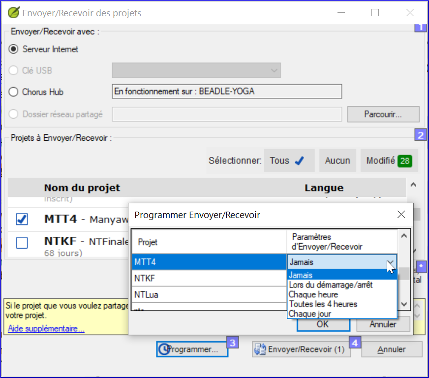

---
title: Envoyer/Recevoir régulièrement pour garder un projet  (0.4c)partagé synchronisé
---

Dans cette vidéo, vous avez appris à utiliser envoyer/recevoir régulièrement pour continuer à partager votre travail avec vos collègues et pour recevoir leurs modifications.

### Envoyer/recevoir - icône sur la barre des tâches

-   Utilisez l'icône de raccourci sur la barre des tâches pour effectuer le même type d'envoi/réception.

### Envoyer/recevoir - menu projet ≡

-   Cliquez sur le menu du projet **≡**
-   Choisir Envoyer/Recevoir ce projet

### Programmer l’envoyer/recevoir

-   Cliquez sur le menu principal de Paratext **≡**
-   Choisissez **Envoyer/Recevoir des projets**

    

-   Cliquez sur **Programmer**.
-   Sélectionnez le projet.
-   Choisissez le mode de programmation (chaque heure, toutes les quatre heures, quotidien, ou au démarrage et à l'arrêt de Paratext)
-   Cliquez sur **OK** pour fixer la programmation
-   Cliquez sur **Annuler** pour fermer le dialogue Envoyer/recevoir.

