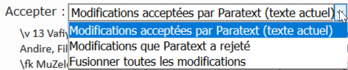

---
title: Qu’est-ce qu’un conflit (1.6)
---

Un conflit se produit lorsque deux personnes ou plus modifient le texte en même temps. Paratext s'embrouille et ne sait pas lequel garder. Il en choisit un et y ajoute une note de conflit.

Il est préférable d’avoir un seul traducteur modifier un texte à la fois. Les autres membres de l’équipe devraient ajouter des notes de leurs suggestions (voir les vidéos ultérieures sur les notes).

## 1.6.1 Résoudre les conflits

[Regarder le vidéo](https://vimeo.com/465445125)

Dans cette vidéo, nous verrons à quoi ressemblent les notes de conflit et comment les traiter. C'est identique dans Paratext 8 et 9.

-   Faire un envoyer/recevoir
-   Cliquez sur le lien Ouvrir la fenêtre de liste des remarques de conflit non résolues.

#### Ouvrir la note et résoudre les conflits

-   **Ouvrir** la remarque
-   Si la note vous est confiée, ou si vous êtes un administrateur, il y aura une liste déroulante
-   Faites défiler la liste en haut de page

    

-   Choisissez une option selon le cas
-   Accepter les changements acceptés par Paratext (laisser en l'état)
-   Accepter les modifications rejetées par Paratext (et rejeter l'autre modification)
-   Fusionner toutes les modifications (accepter les deux changements)
-   Cliquez sur **OK**

    Drapeau d’avertissement spécial pour les notes de conflit sont soit au tout début du livre ou au numéro de verset.

-   **Résoudrez** la note pour faire disparaître le drapeau.

#### Envoyer/Recevoir

-   Faire un envoyer/recevoir

#### Des conflits complexes

S'il y a de nombreux conflits, votre administrateur peut avoir besoin de **rétablir** le(s) livre(s).
