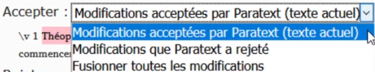

## À quoi elles ressemblent et comment les gérer
[Voir la vidéo](https://vimeo.com/465445125)

Dans cette vidéo, nous allons voir à quoi ressemblent les notes de conflit et comment les gérer. C'est la même dans Paratext 8 et 9.

- Effectuer un envoyer/recevoir
- Cliquez sur le lien **Ouvrir la fenêtre de la liste de notes de conflit non résolues**.

**Ouvrir la note et résoudre le conflit**

- **Ouvrir** la note
- Si la note vous est attribuée, ou si vous êtes un administrateur, une liste déroulante s'affiche.
- Cliquez sur la liste déroulante en haut

    

- Choisissez l'option qui vous convient
- **Accepter** les modifications Paratexte **accepté** (laisser tel quel)
- Accepter** les changements Paratext **rejetés** (et rejeter l'autre changement)
- **Fusionner** tous les changements (accepter les deux changements)
- Cliquez sur **OK**

Un drapeau d'avertissement spécial pour les notes de conflit se trouvent soit au tout début du livre, soit au numéro du verset.

- Résolvez** la note pour que le drapeau disparaisse.

**Envoyer/Recevoir**

- Faites un Envoyer/Recevoir

**Conflits complexes**

S'il y a de nombreux conflits, votre administrateur peut avoir besoin de réverser le(s) livre(s).
